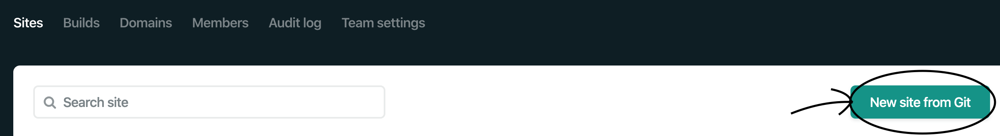
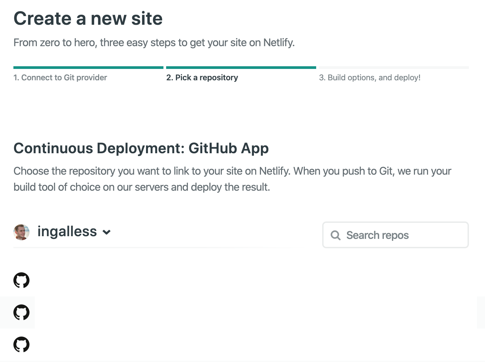
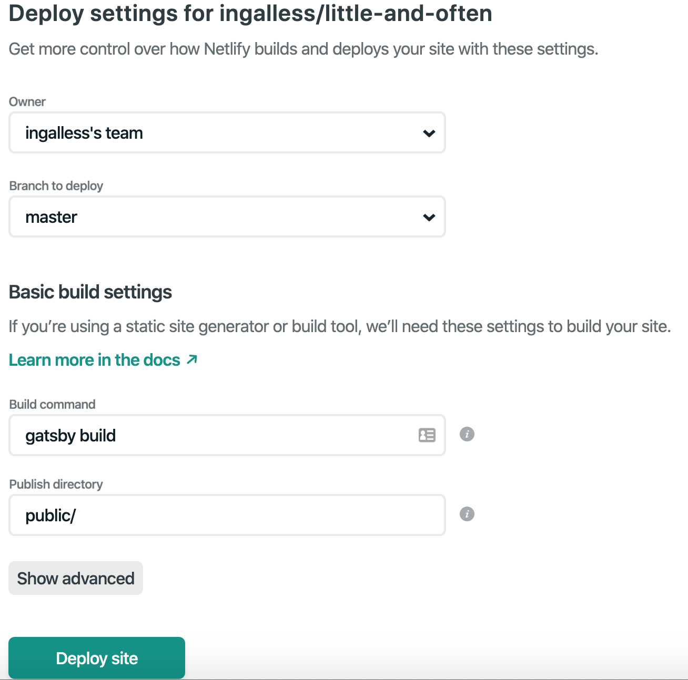

When I studied Web Development in college I had no idea how to host a website. When I started an apprenticeship in Web Development I assumed the start-up costs were too high. And maybe at that time there was a relatively high cost to hosting a website. Wordpress was the leading solution for personal blogging and these services seemed pricy, especially for a developer who wondered why they couldn't just host it themselves!

Today the development landscape is very different. JS has evolved greatly from the days of JQuery. The emmergence of Markdown has provided an easy to digest writing format. More companies are supporting solo-developers. Is there any hope for us today?

Fortunately, [Netlify](https://netlify.com) are awesome. [Gatsby](https://gatsbyjs.org) are too! In this post I'm going to breakdown how to get a free static website up and running (**spoiler**: it's dead simple!)

## Requirements

1. [Github account](https://github.com/join)
2. [Netlify account](https://app.netlify.com/signup) linked to your Github account

## Setting up your first Netlify site
Once you're logged into Netlify, find the "New Site from Git" button pictured below.

A Wizard will appear for configuring continuous deployment. Choose your preferred Git provider and follow the instructions on-screen to connect to it. I'll join you at step 2: Pick a repository!

### 2. Pick a repository
You will now be asked to pick a repository. Choose whichever repository homes source code for your static site.

### 3. Build options, and deploy!
You'll now be presented with a form to complete the deployment configuration.

#### Branch to deploy
This is the branch gatsby will watch and use to trigger rebuilds. `master` is fine for most projects, but you may choose to use another branch.

#### Build command
The command which will run everytime a build is triggered. For gatsby builds, this is done with `gatsby build`, but you're project may use something different! (e.g. `npm run build`)

#### Public directory
This tells Netlify which folder your static assets build to. Usually this is `public/`. However your project may use something different!

#### Deploy!
To finish off, hit deploy!

## Where now?
If all has gone well then you'll be assigned a custom Netlify domain (something like silly-cactus-a54cf.netlify.com). [You might now configure a custom domain](https://docs.netlify.com/domains-https/custom-domains/). Or [maybe you'll configure https](https://docs.netlify.com/domains-https/https-ssl/).

You could also take a look at my [blog's code](https://github.com/ingalless/little-and-often)!

Whatever you choose to do, your website is online and your ideas are being shared with the world.